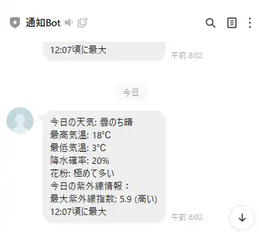

#天気情報通知アプリ

## 概要
このプロジェクトは、Google Apps Script（GAS）を使用して、指定した地域の天気情報を取得し、LINEに通知するアプリです。ユーザーは、特定の時間に天気情報を受け取ることができます。

  

## 通知情報
- 今日の天気
- 最高気温
- 最低気温
- 降水確率
- 花粉情報
- 紫外線情報

## インストール
.jsファイルの内容をGASに転記してください。

使用するAPI
- LINE Message API（通知用）
    参考URL: https://qiita.com/MikH/items/d9876b6e50f7c8510d0b
- OPEN UV API（UV情報取得用）

使用するスクレイピングサイト
- xxxxx（天気、花粉情報）
    利用規約によりスクレイピングが禁止されているため、名前を伏せます。利用する場合は、自己責任でお願いします

## インストール
- .jsファイルの内容をGASに転記し、global_var.gsに必要な情報を記載してください
- global_var.gsのsetScriptProperties関数を実行してプロパティサービスに変数を登録します
- code.gsのcreateTrigger関数を実行し、Webアプリとしてデプロイすれば完了です
